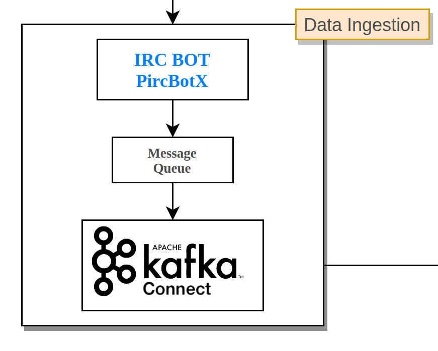
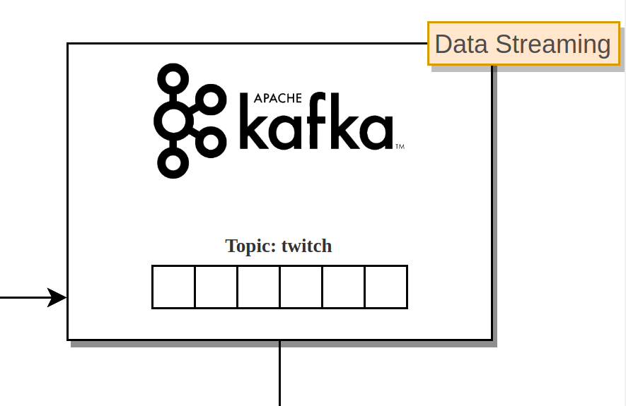

# Kafka and Custom Kafka Connector

>Apache Kafka is a community distributed event streaming platform capable of handling trillions of events a day. Initially conceived as a messaging queue, Kafka is based on an abstraction of a distributed commit log. Since being created and open sourced by LinkedIn in 2011, Kafka has quickly evolved from messaging queue to a full-fledged event streaming platform.

Source: [Kafka](https://bit.ly/2Vqowhq "Kafka")

>Kafka Connect, an open source component of Apache Kafka®, is a framework for connecting Kafka with external systems such as databases, key-value stores, search indexes, and file systems. 

Source: [Kafka Connect](https://docs.confluent.io/current/connect/index.html "Kafka Connect")

### Data Ingestion
<p align="center"></p>


Data ingestion is the process of obtaining and importing data for immediate use or storage in a database.

The Kafka-Connector folder contains a maven project that combines the use of an IRC bot ([Internet Relay Chat](https://en.wikipedia.org/wiki/Internet_Relay_Chat "IRC")) such as [PircBotX](https://github.com/pircbotx/pircbotx "PircBotX") and the creation of a custom connector. You can start creating a simple maven project using eclipse or whatever.

#### IRC (Internet Relay Chat)
>Internet Relay Chat (IRC) is an application layer protocol that facilitates communication in the form of text. The chat process works on a client/server networking model. IRC clients are computer programs that users can install on their system or web based applications running either locally in the browser or on a 3rd party server. These clients communicate with chat servers to transfer messages to other clients. IRC is mainly designed for group communication in discussion forums, called channels, but also allows one-on-one communication via private messages as well as chat and data transfer, including file sharing.

Source: [Wikipedia](https://en.wikipedia.org/wiki/Internet_Relay_Chat)

### Resource creation (websocket, API poll, BOT) to get the data flow.
This project uses a library that makes a java bot available to interface with the IRC protocol: [PircBotX](https://github.com/pircbotx/pircbotx "PircBotX"). This is a simple way to configure and starts it.

#### Maven Import
First you need to add the following to the `<dependencies>` section in your pom.xml
```java
<dependency>
    <groupId>com.github.pircbotx</groupId>
    <artifactId>pircbotx</artifactId>
    <version>2.2</version>
</dependency>
```
#### Bot Configuration
Then you can configure and run your bot:
```java
Configuration config = new Configuration.Builder()
		.setAutoNickChange(false) 
		.setOnJoinWhoEnabled(false)
		.setCapEnabled(true)
		.addCapHandler(new EnableCapHandler("twitch.tv/membership")) 
		.addServer("irc.twitch.tv")
		.setName(channelUsername) //Your twitch.tv username
		.setServerPassword(oauth) //Your oauth password from http://twitchapps.com/tmi
		.addAutoJoinChannel(channel) //Some twitch channel		
		.addListener(new ChatMessageListener(targetChannelUsername))
		.buildConfiguration();
		
PircBotX clientBot = new PircBotX(config);

clientBot.startBot();
```
The bot needs a listener (in this case **ChatMessageListener**) that implements the ListenerAdapter interface. By overriding the onGenericMessage method, we will get all the messages related to the chat indicated in the configuration. This following code show also how to parse this information to JSON. Feel free to use any JSON library, here [org.json](https://mvnrepository.com/artifact/org.json/json) is used.

```java
public class ChatMessageListener extends ListenerAdapter  {
	
	private String targetChannelUsername;
	
	public ChatMessageListener(String targetChannelUsername) {
		this.targetChannelUsername = targetChannelUsername;
	}
	
	@Override
	public void onGenericMessage(GenericMessageEvent event) throws Exception {
		super.onGenericMessage(event);
        // making some prioritization and input validation
		String user = event.getUser().getIdent().toLowerCase(); 
		if(user.length() >= 3 && event.getMessage().charAt(0) != '!') {
			String botChecker = user.substring(user.length() - 3);
			if(!user.equals("streamelements") && !user.equals("streamlabs") && !botChecker.equals("bot"))
				MessageQueue.getInstance().put(StringEscapeUtils.unescapeJava(parseToJSONString(event)));
		}
			
		
	}
	
	private String parseToJSONString(GenericMessageEvent event) {
		JSONObject json = new JSONObject();
		json.put("targetChannelUsername", targetChannelUsername)
				.put("nickname", event.getUser().getNick())
				.put("userId", event.getUser().getUserId().toString())
				.put("message", event.getMessage().replace("\"", "'"))
				.put("timestamp", event.getTimestamp());
		  
		 return json.toString();
	}	
```
### Message queue
You need to set up a message queue class where the bot can insert JSON. Here was used a LinkedBlockingQueue Singleton to get benefits of a blocking queue.

### Custom Kafka Connector (Source)

#### Maven Import
First you need to add the following to the `<dependencies>` section in your pom.xml
```java
<dependency>
	<groupId>org.apache.kafka</groupId>
	<artifactId>connect-api</artifactId>
	<version>2.4.1</version>
</dependency>
```
Check new version [here](https://mvnrepository.com/artifact/org.apache.kafka/connect-api)

#### Structure
The connector consists of two main classes that extend the following:
- **SourceConnector**, main class that set and manage SourceTask properties;
- **SourceTask**, actively get data from any source and put them into Kafka-topic. 

Only one SourceTask is set up in this project. However, they can be a lot.

#### SourceConnector Override

The **SourceConnector** class takes care of initializing properties class attribute from the file `chat-message.properties`:

```java
@Override
public void start(Map<String, String> props) {
	kafkaTopic = props.get("topic");
	username = props.get("channel.username");
	oauth = props.get("oauth");
	channel = props.get("channel");
	channelUsername = props.get("target.channel.username");
}
```
It also initializes each individual task (in this project only 1) through this method: 

```java
@Override
public List<Map<String, String>> taskConfigs(int maxTasks) {
	List<Map<String, String>> configs = new ArrayList<Map<String, String>>();
	Map<String, String> config = new HashMap<String, String>();
	config.put("topic", kafkaTopic);
	config.put("username", username);
	config.put("oauth", oauth);
	config.put("channel", channel);
	config.put("channelUsername", channelUsername);
	configs.add(config);
	return configs;
}
```

#### SourceTask Override
The **SourceTask** class takes care of setting data topic partition created.
The start method initializes the properties of the task, originating from the SourceConnector.

**N.B**: Thread here is used. If we didn't use it, the bot would take over and the next code snippets will never be executed. By inserting it in a thread, we separate the execution contexts, allowing a parallel execution of the bot and the connector.

```java
@Override
public void start(Map<String, String> props) {
	kafkaTopic = props.get("topic");
	clientBot = new Thread(new BotClient(props.get("channelUsername"), props.get("username"), props.get("oauth"), props.get("channel")), "twitch_bot_" + props.get("channel"));	
	clientBot.start();
	queue = MessageQueue.getInstance();
	count = 0L;		
}
```
Using the **poll()** method it initializes a **List \<SourceRecord\> records** . It adds SourceRecord to the list until the queue is empty. Finally returns the created list, whose elements will be set into topic partition indicated by each SourceRecord.

```java
@Override
public List<SourceRecord> poll() throws InterruptedException {
	List<SourceRecord> records = new ArrayList<SourceRecord>();
	while (!queue.isEmpty()) {
		String data = queue.take();
		SourceRecord record = new SourceRecord(offsetKey(OFFSET_KEY), offsetValue(count++), kafkaTopic, Schema.STRING_SCHEMA, data);
		records.add(record);
	}		
	return records;
}
```

It is necessary to set two properties files:
- **chat-message.properties**: deals with initializing properties of the connector and also to the resource used to collect the data.

```sh
#Application name. This must be unique across all Kafka connectors used by the customer.
name=twitch_chat_message
#Source connector class
connector.class=kafkaconnector.ChatMessageSourceConnector
#max tasks
tasks.max=1
#kafka topic name, change if you know what are you doing
topic=twitch
#Your twitch.tv username
channel.username=username
#Your oauth password from http://twitchapps.com/tmi
oauth=oauth:YOUR_KEY
#Target twitch channel, this property is used to get the chat message stream, must be lower case, starting with #
channel=#CHANNEL_NAME
#Target twitch channel name
target.channel.username=TARGET_CHANNEL_USERNAME
```
- **worker.properties**: takes care of defining general connector properties.

```sh
bootstrap.servers=localhost:9092

group.id=connect-cluster 

key.converter=org.apache.kafka.connect.storage.StringConverter
value.converter=org.apache.kafka.connect.storage.StringConverter

offset.storage.file.filename=/tmp/connect.offsets  

plugin.path=/usr/local/share/kafka/plugins
```

### Data Streaming
<p align="center"></p>

Data streaming is data that is continuously generated by different sources. 

Apache Kafka is a community distributed event streaming platform capable of handling trillions of events a day. Initially conceived as a messaging queue, Kafka is based on an abstraction of a distributed commit log.

This project uses Kafka to stream messages from the Kafka-Connector. They will be inserted in a Kafka-topic and will be made available to one or more consumers.

#### Getting Kafka tgz
**N.B.** You need to download and insert the tgz file in the Kafka-Settings folder, you can download it from [here](https://downloads.apache.org/kafka/2.5.0/kafka_2.12-2.5.0.tgz).

### Setup & Build & Run
**N.B.** This project uses Docker as a containerization tool. Make sure you have it installed. Look online to understand how to install it in your system.

To build and run this container, you need just to setup  **chat-message.properties**. Then use `bin/kafka-start.sh` script. it performs 3 main steps:

- The Kafka-Connector folder contains the connector's maven project. The script run `mvn package` to create an Uber/Fat Jar;
- Created Jar is copied into Kafka-Settings folder;
- Connector image is built using docker. In this step `chat-channel.properties`, `worker.properties`, `kafka-starter.sh`, jar connector file, kafka.tgz are all copied into container image (you can see it [here](https://github.com/Warcreed/Twitch-Chat-Analyzer/blob/master/Kafka/Dockerfile))


The kafka-starter script is copied by docker into the container at the time it is built. It is invoked when the container is run. It runs this commands below:
```sh
$ bin/kafka-server-start.sh config/server.properties --override zookeeper.connect=$ZOOKEEPER_SERVER &
```
Using standard server properties and custom Zookeeper server IP, defined into Dockerfile.

```sh
$ bin/connect-standalone.sh conf/worker.properties conf/chat-channel.properties
```
`connect-standalone.sh` run connector in the standalone mode. According to the [doc](https://docs.confluent.io/current/connect/userguide.html):
>Standalone mode is useful for development and testing Kafka Connect on a local machine. It can also be used for environments that typically use single agents.

### Stop Kafka Container

To stop Kafka container gracefully use `Ctrl + C`. 

### Test it with Kafka Console Consumer
If everything was done correctly, you can test the connector through the consumer kafka console.
In the Kafka-test-consumer folder, run:

```sh
$ docker build . --tag twitch-kafka:test_consumer
$ docker run -it -network twitch-chat-analyzer_twitch --ip 10.0.100.26 -p 9092 twitch-kafka:test_consumer
```
The dockerfile takes care of copying the kafka-starter.sh script and starting a consumer by connecting it to the server taken from the bootstrap.server.
If all went well, you should see the messages consumed and be shown directly in bash.

Useful resources:
- [Confluent Connect guide](https://docs.confluent.io/current/connect/devguide.html)
- [Github Repo kafka connect example](https://github.com/apache/kafka/tree/trunk/connect/file/src/main/java/org/apache/kafka/connect/file)
- [Connect installing plugins](https://docs.confluent.io/current/connect/userguide.html#connect-installing-plugins)