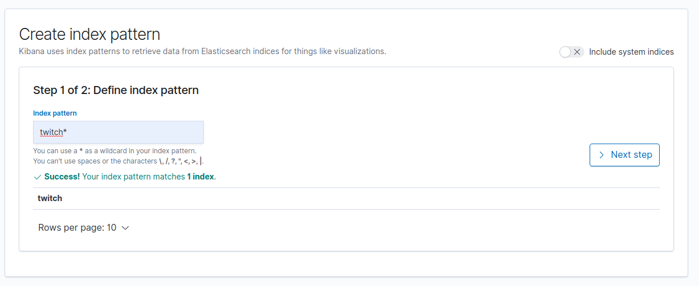
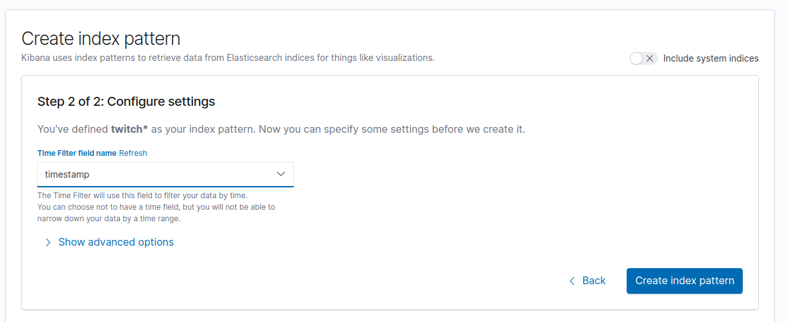
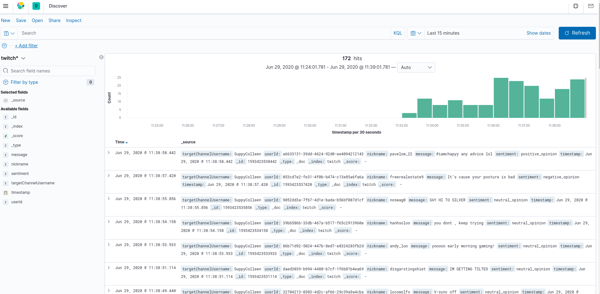
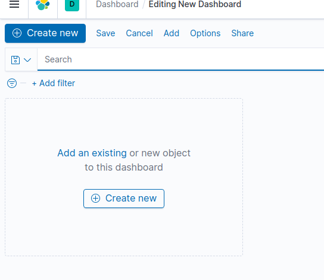

# Kibana
Kibana is an open source data visualization plugin for Elasticsearch. It provides visualization capabilities on top of the content indexed on an Elasticsearch cluster. Users can create bar, line and scatter plots, or pie charts and maps on top of large volumes of data.

In this project, Kibana performs user visual data interface, showing an interactive dashboard that the user can customize

## Setup

Kibana carries out its setup automatically for this project.

## Boot up process

You can run Kibana using this shell script in the main bin folder of this project.

```sh
$ bin/kibana-start.sh
```
## Interface
<p align="center"></p>

This is a sample dashboard you can create with kibana, but first we need to set index.

Go to Management -> Kibana -> Index Patterns and click on **Create index pattern**.
<p align="center"></p>

Here you can specify your index. After clicking on **next step**, you need to select a filter field. Select **timestamp** and **Create index pattern**.

<p align="center"></p>

Now you can go to Kibana -> Discover and find your data mapped by timestamp.

<p align="center"></p>

Go to Kibana -> Dashboard and select **Create new**.

<p align="center"></p>

Now you can customize your own dashboard, the limit is just your imagination. Enjoy!

## Technical insights
- image: docker.elastic.co/kibana/kibana:7.8.0
- container_name: "twitch-kibana"
- ipv4_address: "10.0.100.52"
- ports: 5601:5601
- network: twitch-chat-analyzer_twitch 